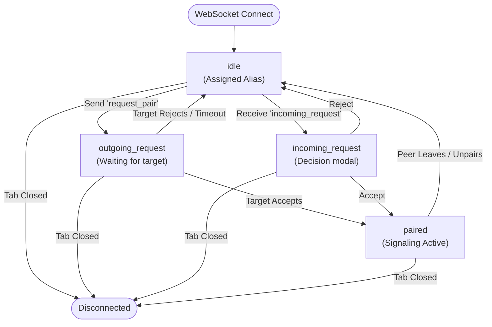
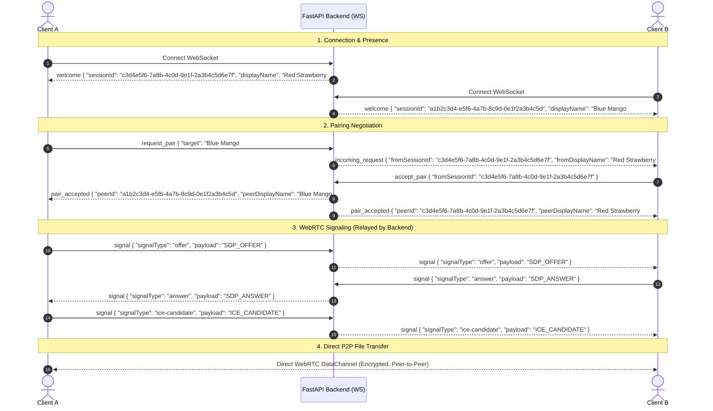

# System Architecture

## 1. Overview
The P2P Transfer application enables direct browser-to-browser file transfers using WebRTC Data Channels. To establish a peer-to-peer connection between two browsers behind NATs/firewalls, a lightweight signaling and presence server is required.

This document details the architectural design, communication boundaries, and lifecycle of a peer session.

---

## 2. High-Level Architecture

```
                     ┌────────────────────────┐
                     │     FastAPI Backend    │
                     │   (Signaling & Relay)  │
                     │       WebSockets       │
                     └───────▲────────▲───────┘
                             │        │
             WS Registration │        │ WS Registration
             & Signaling     │        │ & Signaling
                             │        │
                     ┌───────▼─┐    ┌─▼───────┐
                     │ Client A│    │ Client B│
                     │ (Peer 1)│    │ (Peer 2)│
                     └─────────┘    └─────────┘
                          ▲              ▲
                          │              │
                          └──────────────┘
                         WebRTC DataChannel
                         (Direct P2P Transfer)
```

### Components
1. **Frontend (Browser Client):**
   - Connects to the backend via WebSocket upon loading.
   - Displays assigned human-readable alias (e.g., `Red Strawberry#2233`).
   - Handles pairing user interaction (send request, accept/reject modal).
   - Establishes `RTCPeerConnection` and opens `RTCDataChannel`.
   - Transfers files chunk-by-chunk directly peer-to-peer (zero file data hits the backend).

2. **Backend (FastAPI + WebSockets):**
   - **Presence Management:** Tracks connected clients in-memory with automatic cleanup on disconnection.
   - **Pairing Coordinator:** Validates and routes connection requests and acceptance/rejection between peers.
   - **Signaling Relay:** Transparently forwards WebRTC session descriptions (SDP offers/answers) and ICE candidates between paired peers.
   - **Zero File Handling:** Does not store, proxy, or inspect file payloads, keeping memory and CPU footprint near zero.

---

## 3. Client Lifecycle & State Machine

Each connected peer transitions through the following states in the backend:



### State Descriptions:
- **`idle`**: The client is online, waiting to pair or receive a request.
- **`outgoing_request`**: The client has sent a pairing request to another peer and is waiting for their decision.
- **`incoming_request`**: The client has an incoming request and must accept or reject.
- **`paired`**: The two peers are mutually associated and can exchange WebRTC signaling messages (`offer`, `answer`, `ice-candidate`).

---

## 4. WebRTC Connection Establishment Flow



---

## 5. Security & Privacy Considerations
1. **No Data Retention:** File payloads never reach the server.
2. **End-to-End Encryption:** WebRTC Data Channels enforce DTLS (Datagram Transport Layer Security) encryption out of the box.
3. **Explicit Consent:** A connection is never established automatically; target peers must explicitly click "Accept" before any signaling or data transfer starts.
4. **Instant Teardown:** Disconnecting the WebSocket immediately unpairs the peer and notifies the partner, preventing stale sessions.

